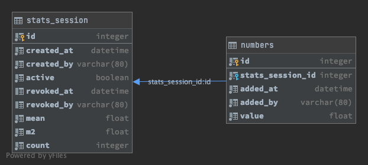

# Coding Exercise 1 - Mean and Standard Deviation

## Live demo
Try it out at <https://cryptic-dusk-44925.herokuapp.com> (may take a few seconds to wake up).

## Running locally
This is a Python3 app using Flask. I suggest using a virtual environment to manage dependencies.
Assuming you're on Linux or macOS (and have Python3 and pip installed) you can create and activate
a virtual environment with:
```
python3 -m venv venv
source venv/bin/activate
```

Dependencies can then be installed:
```
pip install -r requirements.txt
```

and schemas created in a local (sqlite) database:
```
# Creates a new DB in the instance/ directory
flask db upgrade
```

Then to run locally:
```
# Run the server - access at http://127.0.0.1:5000
flask run
```

To run tests:
```
python -m pytest
```

## Discussion of the problem
It seems undesirable to have to keep track of all previously entered numbers - as then the complexity of calculating the
stats would grow in proportion to the total count of numbers received. A shortcut for mean was obvious (just store the count
and most recent mean). A similar approach for standard deviation wasn't something I'd previously worked with, but a small
amount of research (aka google) led me to [Welford's online algorithm] which seemed appropriate here.

[Welford's online algorithm]: https://en.wikipedia.org/wiki/Algorithms_for_calculating_variance#Welford%27s_online_algorithm

The next point concerns stateful v stateless processes. Regardless of *what* we keep track of, we do need to track *some* previous
state. Therefore it seems wrong not to persist the tracked state outside of the application's memory (or filesystem for that matter). 
That way we get availability and scalability, but more importantly we get correctness - unless we can be sure there's only one copy
of our app running (and one thread at that) then we need to lock access to the running totals in some way. The obvious place to
persist is a database, with cross-process locking provided by transactions where necessary.

As for the data model, I went with something simple - a single row (in the `stats_session` table) holding all the tracking data we need
(3 values - `mean`, `m2` & `count`). It seemed useful to support resetting the stats, and I decided to model this as starting a new 
*"stats session"*. That lets me retain the last results of previous sessions. Therefore each row has an `active` flag, and there can be 
at most one active row in the table.

Using the concept of a session meant I had a place to hang *"audit"* records in the table `numbers`,
which is my solution to the requirement to *"log an event to record that something happened and when"* (along with the `created` & `revoked`
fields in the main table). Here we actually *do* keep track of every number submitted - although they are not required for the calculations.
I decided to add the concept of usernames too, in order to give something basic to identify different users by (implementing unique names was
definitely out of scope!). An alternative to all this (and perhaps what was intended in the question...) would be to allow multiple active 
sessions at once, generating unique urls for each session. Then users can share the urls with anybody they want.




## Implementation notes
I've written this in Python 3.7.7, using the Flask framework to build a small REST API. Flask is very lightweight so suitable for an exercise like
this, although my choice was partly driven by my decision to host the app on Heroku - which supports this stack well. The database can be
any compatible SQL one, with Postgres being what is used on Heroku.

My Flask server also serves up a pretty basic, SPA-style web page which I wrote in Vanilla JS. Introducing any JS framework or library seemed
too much of a distraction for a task like this. I did use Bootstrap to do some heavy lifting regarding layout and styling.

I was developing on macOS Big Sur.


## Future improvements
For a production quality app there's plenty of improvements to pick from - better error handling, authentication & authorisation, API versioning,
more automated tests (including front-end & end-to-end) to name a few. Particularly on the point of tests, I would have liked to include more unit
tests already - but time constraints prevented this!

I'd definitely revisit the choice of technology too, if requirements changed and the app had to scale up to many users or to support new features.
One thing that seemed suitable (but I don't really have any experience of) was to use web sockets to keep clients informed of changes.

On the database side I wonder if we need higher precision data types for the tracking stats we're storing. I'd also want to consider an
archiving plan for the `numbers` table, as currently it grows unbounded. 
